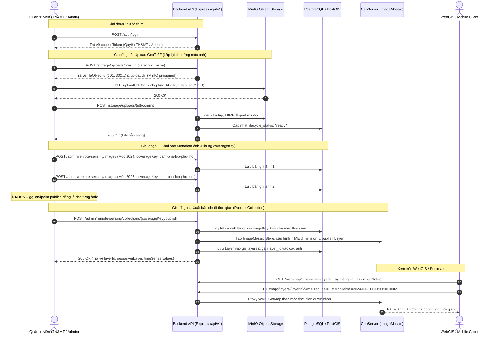

# Quy Trình Chuẩn Tạo Chuỗi Thời Gian (Time Series) Từ File GeoTIFF

Tài liệu hướng dẫn chi tiết từ A đến Z quy trình tạo mới và xuất bản một lớp bản đồ chuỗi thời gian (**Time Series ImageMosaic**) từ các tệp ảnh vệ tinh GeoTIFF trên hệ thống Cẩm Phả HydroMap.

---

## 1. Tổng Quan Kiến Trúc & Luồng Thực Hiện

Hệ thống hỗ trợ quản lý các chuỗi ảnh vệ tinh viễn thám (Sentinel-1, Sentinel-2, Landsat, Drone,...) theo trục thời gian. Quy trình gồm **4 giai đoạn chính**:



### Tóm Tắt Các Điểm Trọng Yếu:
1. **Tránh nghẽn RAM Backend**: File GeoTIFF lớn được đẩy trực tiếp từ Client lên MinIO thông qua **Presigned PUT URL**. Backend không giữ buffer file nhị phân trong bộ nhớ.
2. **Khóa nhóm (`coverageKey`)**: Các bức ảnh thuộc cùng một chủ đề theo thời gian phải được gán **cùng một `coverageKey`**, nhưng có giá trị `acquiredAt` khác nhau.
3. **Không publish ảnh đơn lẻ**: Nếu mục đích là tạo chuỗi thời gian, chỉ tạo bản ghi ảnh và **dừng lại**, không gọi `POST /images/:id/publish`.
4. **Publish Collection**: Chỉ cần gọi lệnh publish 1 lần cho `coverageKey`, server sẽ tự động đóng gói toàn bộ ảnh thành ImageMosaic với chiều không gian thời gian (Temporal Dimension).

---

## BƯỚC 1: Đăng Nhập Lấy Token Xác Thực

Tài khoản thực hiện cần có quyền quản trị tài nguyên raster và lớp bản đồ (`raster.create`, `layers.create`), ví dụ tài khoản cán bộ Phòng Tài nguyên & Môi trường Cẩm Phả.

- **Method**: `POST`
- **URL**: `https://apicampha.tourismpj.pro.vn/api/v1/auth/login`
- **Headers**:
  ```http
  Content-Type: application/json
  ```
- **Request Body**:
  ```json
  {
    "email": "tnmt@campha.gov.vn",
    "password": "CamPha@2026"
  }
  ```

### Response thành công (`200 OK`):
```json
{
  "message": "Đăng nhập thành công",
  "status": 200,
  "data": {
    "accessToken": "eyJhbGciOiJIUzI1NiIsInR5cCI6IkpXVCJ9...",
    "refreshToken": "...",
    "user": {
      "id": "15",
      "email": "tnmt@campha.gov.vn",
      "role": "so_tnmt"
    }
  }
}
```

> [!TIP]
> Lưu lại giá trị `data.accessToken` để gắn vào Header các request tiếp theo:
> `Authorization: Bearer <accessToken>`

---

## BƯỚC 2: Tải Lên Các File GeoTIFF Vào Kho Lưu Trữ

Để tạo chuỗi thời gian, bạn cần chuẩn bị **tối thiểu 2 file GeoTIFF** tương ứng với các mốc thời gian khác nhau. Thực hiện lần lượt quy trình 3 bước con dưới đây cho từng file.

### 2.1. Xin đường dẫn tải lên (Presign URL)
- **Method**: `POST`
- **URL**: `https://apicampha.tourismpj.pro.vn/api/v1/storage/uploads/presign`
- **Headers**:
  ```http
  Authorization: Bearer <accessToken>
  Content-Type: application/json
  ```
- **Request Body (Ví dụ cho ảnh năm 2024)**:
  ```json
  {
    "category": "raster",
    "originalName": "Lop_phu_Cam_Pha_2024.tif",
    "contentType": "image/tiff",
    "expireSeconds": 900
  }
  ```

#### Response thành công (`201 Created`):
```json
{
  "message": "Tạo URL upload thành công",
  "status": 201,
  "data": {
    "id": 301,
    "uploadUrl": "https://minio.tourismpj.pro.vn/campha-storage/raster/2026/09/uuid-Lop_phu_Cam_Pha_2024.tif?X-Amz-Algorithm=...",
    "expiresAt": "2026-09-07T02:25:00.000Z"
  }
}
```
*Ghi nhớ `data.id = 301` và `data.uploadUrl`.*

---

### 2.2. Đẩy file nhị phân trực tiếp lên MinIO
- **Method**: `PUT`
- **URL**: Dán nguyên đường link `data.uploadUrl` nhận được từ bước 2.1.
- **Headers**:
  ```http
  Content-Type: image/tiff
  ```
  *(⚠️ Không gửi header `Authorization: Bearer ...` lên MinIO, vì chữ ký SigV4 đã nằm trên query parameters của URL).*
- **Body**: Chọn dạng **Binary** và trỏ tới file `Lop_phu_Cam_Pha_2024.tif` trên máy.
- **Response mong đợi**: HTTP `200 OK` (Body rỗng).

> [!WARNING]
> Request `PUT` này gửi trực tiếp đến server MinIO, không qua backend Node.js. Không dùng `multipart/form-data` hoặc JSON ở bước này.

---

### 2.3. Xác nhận hoàn tất upload (Commit)
Báo cho server backend biết file đã được tải lên thành công để server kiểm tra tính hợp lệ và quét mã độc.

- **Method**: `POST`
- **URL**: `https://apicampha.tourismpj.pro.vn/api/v1/storage/uploads/301/commit`
- **Headers**:
  ```http
  Authorization: Bearer <accessToken>
  ```
- **Body**: Rỗng (không cần body).

#### Response thành công (`200 OK`):
```json
{
  "message": "Upload hoàn tất",
  "status": 200,
  "data": {
    "id": "301",
    "lifecycle_status": "ready",
    "scan_status": "clean",
    "detected_mime": "image/tiff",
    "file_size": 52428800
  }
}
```
Khi `lifecycle_status` là `"ready"`, file đã sẵn sàng. Ghi nhớ `fileObjectId = 301`.

---

> [!NOTE]
> **Lặp lại Bước 2.1 → 2.3 cho bức ảnh thứ 2 (Ví dụ: Năm 2026):**
> 1. Presign với `originalName: "Lop_phu_Cam_Pha_2026.tif"` → Nhận `data.id = 302`.
> 2. PUT binary file lên `data.uploadUrl` của 302.
> 3. Commit tại `/storage/uploads/302/commit` → Nhận `fileObjectId = 302` sẵn sàng.

---

## BƯỚC 3: Khai Báo Metadata Ảnh Vệ Tinh (Gán CHUNG coverageKey)

Tạo bản ghi dữ liệu viễn thám trong cơ sở dữ liệu. Điểm mấu chốt: **Cả 2 ảnh bắt buộc phải có cùng `coverageKey`**, nhưng khác giá trị thời gian chụp (`acquiredAt`).

### 3.1. Tạo bản ghi cho ảnh Mốc 1 (Năm 2024)
- **Method**: `POST`
- **URL**: `https://apicampha.tourismpj.pro.vn/api/v1/admin/remote-sensing/images`
- **Headers**:
  ```http
  Authorization: Bearer <accessToken>
  Content-Type: application/json
  ```
- **Request Body**:
  ```json
  {
    "sceneCode": "CP-LP-2024",
    "title": "Lớp phủ Cẩm Phả năm 2024",
    "platform": "sentinel-2",
    "thematicGroup": "lop-phu",
    "coverageKey": "cam-pha-lop-phu-moi",
    "acquiredAt": "2024-01-01T00:00:00.000Z",
    "resolutionM": 10,
    "fileObjectId": 301
  }
  ```

#### Response (`201 Created`):
```json
{
  "message": "Tạo ảnh vệ tinh thành công",
  "status": 201,
  "data": {
    "id": "55",
    "scene_code": "CP-LP-2024",
    "coverage_key": "cam-pha-lop-phu-moi",
    "acquired_at": "2024-01-01T00:00:00.000Z",
    "layer_id": null
  }
}
```

---

### 3.2. Tạo bản ghi cho ảnh Mốc 2 (Năm 2026)
- **Method**: `POST`
- **URL**: `https://apicampha.tourismpj.pro.vn/api/v1/admin/remote-sensing/images`
- **Headers**:
  ```http
  Authorization: Bearer <accessToken>
  Content-Type: application/json
  ```
- **Request Body**:
  ```json
  {
    "sceneCode": "CP-LP-2026",
    "title": "Lớp phủ Cẩm Phả năm 2026",
    "platform": "sentinel-2",
    "thematicGroup": "lop-phu",
    "coverageKey": "cam-pha-lop-phu-moi",
    "acquiredAt": "2026-01-01T00:00:00.000Z",
    "resolutionM": 10,
    "fileObjectId": 302
  }
  ```

#### Response (`201 Created`):
```json
{
  "message": "Tạo ảnh vệ tinh thành công",
  "status": 201,
  "data": {
    "id": "56",
    "scene_code": "CP-LP-2026",
    "coverage_key": "cam-pha-lop-phu-moi",
    "acquired_at": "2026-01-01T00:00:00.000Z",
    "layer_id": null
  }
}
```

> [!CAUTION]
> **CỰC KỲ QUAN TRỌNG:** Ở bước này chỉ lưu bản ghi vào kho quản lý.
> **TUYỆT ĐỐI KHÔNG GỌI** lệnh `POST /api/v1/admin/remote-sensing/images/:id/publish`. Lệnh đó dùng để xuất bản ảnh đơn lẻ độc lập, nếu gọi sẽ gây xung đột khi xuất bản chuỗi thời gian!

---

## BƯỚC 4: Xuất Bản Chuỗi Thời Gian (Publish Collection ImageMosaic)

Gom toàn bộ các ảnh có chung `coverageKey` thành 1 layer chuỗi thời gian duy nhất trên GeoServer với ImageMosaic plugin.

- **Method**: `POST`
- **URL**: `https://apicampha.tourismpj.pro.vn/api/v1/admin/remote-sensing/collections/cam-pha-lop-phu-moi/publish`
- **Headers**:
  ```http
  Authorization: Bearer <accessToken>
  Content-Type: application/json
  ```
- **Request Body**:
  ```json
  {
    "code": "cam_pha_lop_phu_ts",
    "nameVi": "Lớp phủ Cẩm Phả theo thời gian (2024-2026)",
    "category": "lop-phu",
    "srid": 4326,
    "minZoom": 0,
    "maxZoom": 22,
    "legendConfig": {},
    "metadata": {
      "source": "admin_geotiff_upload"
    },
    "isPublic": true
  }
  ```

### Chi tiết ý nghĩa các trường:
| Trường | Kiểu dữ liệu | Bắt buộc | Ràng buộc & Mô tả |
| :--- | :--- | :--- | :--- |
| `code` | `string` | **Có** | Mã kỹ thuật định danh duy nhất toàn hệ thống (`^[a-z][a-z0-9_]{0,62}$`). Viết thường, không dấu, không dùng gạch nối `-`, nên có hậu tố `_ts`. |
| `nameVi` | `string` | **Có** | Tên hiển thị tiếng Việt trên WebGIS/MobileGIS. |
| `category` | `string` | **Có** | Nhóm danh mục lớp (ví dụ: `lop-phu`, `ngap-lut`, `quy-hoach`). |
| `srid` | `number` | **Có** | Hệ tọa độ gốc của file GeoTIFF (`4326` cho WGS84, `32648` cho UTM 48N). |
| `minZoom` / `maxZoom` | `number` | Không | Ngưỡng zoom hiển thị bản đồ (mặc định: `0` đến `22`). |
| `legendConfig` | `object` | Không | Cấu hình chú giải hiển thị (màu sắc, nhãn phân loại). |
| `isPublic` | `boolean` | Không | `true` để công khai cho khách/người dân xem không cần đăng nhập. |

#### Response thành công (`200 OK`):
```json
{
  "message": "Xuất bản bộ GeoTIFF Time Series thành công",
  "status": 200,
  "data": {
    "coverageKey": "cam-pha-lop-phu-moi",
    "layer": {
      "id": "270",
      "code": "cam_pha_lop_phu_ts",
      "name_vi": "Lớp phủ Cẩm Phả theo thời gian (2024-2026)",
      "publish_status": "published"
    },
    "geoserverLayer": "campha:cam_pha_lop_phu_ts",
    "memberCount": 2,
    "imageIds": ["55", "56"],
    "fileObjectIds": ["301", "302"],
    "timeSeries": {
      "enabled": true,
      "mode": "discrete",
      "defaultTime": "2026-01-01T00:00:00.000Z",
      "values": [
        "2024-01-01T00:00:00.000Z",
        "2026-01-01T00:00:00.000Z"
      ]
    }
  }
}
```

> [!IMPORTANT]
> - `data.layer.id` (ở ví dụ trên là `270`): Dùng ID này để gọi API WMS bản đồ.
> - `data.timeSeries.values`: Chứa danh sách các mốc thời gian ISO UTC đã được sắp xếp tăng dần.

---

## BƯỚC 5: Tích Hợp Hiển Thị Trên WebGIS / Postman

### 5.1. Lấy danh mục Time Series Layers (Dựng thanh trượt Slider)
Frontend gọi endpoint công khai này để lấy danh sách các lớp có hỗ trợ Time Series và các mốc thời gian có sẵn:

- **Method**: `GET`
- **URL**: `https://apicampha.tourismpj.pro.vn/api/v1/web-map/time-series-layers`
- **Headers**: Không bắt buộc (nếu layer công khai `isPublic: true`)

#### Trích đoạn Response (`200 OK`):
```json
{
  "message": "Thành công",
  "status": 200,
  "data": [
    {
      "id": "270",
      "code": "cam_pha_lop_phu_ts",
      "nameVi": "Lớp phủ Cẩm Phả theo thời gian (2024-2026)",
      "isPublic": true,
      "srid": 4326,
      "timeSeries": {
        "enabled": true,
        "mode": "discrete",
        "defaultTime": "2026-01-01T00:00:00.000Z",
        "values": [
          "2024-01-01T00:00:00.000Z",
          "2026-01-01T00:00:00.000Z"
        ]
      }
    }
  ]
}
```

Frontend sử dụng mảng `timeSeries.values` để render các mốc trên Slider.

---

### 5.2. Gọi WMS GetMap theo mốc thời gian

Khi người dùng kéo Slider trên bản đồ đến từng năm/tháng, Frontend gửi request WMS GetMap kèm tham số `time`:

#### Xem ảnh mốc Năm 2024:
```http
GET https://apicampha.tourismpj.pro.vn/api/v1/maps/layers/270/wms?request=GetMap&version=1.3.0&crs=EPSG:4326&bbox=20.909,107.166,21.226,107.416&width=512&height=512&format=image/png&transparent=true&time=2024-01-01T00:00:00.000Z
```

#### Xem ảnh mốc Năm 2026:
```http
GET https://apicampha.tourismpj.pro.vn/api/v1/maps/layers/270/wms?request=GetMap&version=1.3.0&crs=EPSG:4326&bbox=20.909,107.166,21.226,107.416&width=512&height=512&format=image/png&transparent=true&time=2026-01-01T00:00:00.000Z
```

> [!NOTE]
> GeoServer ImageMosaic sẽ tự động nhận diện tham số `time`, truy vấn chỉ mục thời gian và trả về đúng dữ liệu raster của mốc tương ứng với độ trễ cực thấp.

---

### 5.3. Mẫu Code tích hợp Frontend (Mapbox GL JS)

```javascript
// Khởi tạo nguồn Raster Tile cho Time Series Layer
const layerId = '270';
let currentTime = '2026-01-01T00:00:00.000Z'; // Mốc mặc định

function getWmsTileUrl(time) {
  const params = new URLSearchParams({
    request: 'GetMap',
    version: '1.3.0',
    crs: 'EPSG:3857',
    bbox: '{bbox-epsg-3857}',
    width: '256',
    height: '256',
    format: 'image/png',
    transparent: 'true',
    time: time
  });
  return `https://apicampha.tourismpj.pro.vn/api/v1/maps/layers/${layerId}/wms?${params.toString()}`;
}

// Thêm layer vào bản đồ Mapbox
map.addSource('cam-pha-ts-source', {
  type: 'raster',
  tiles: [getWmsTileUrl(currentTime)],
  tileSize: 256
});

map.addLayer({
  id: 'cam-pha-ts-layer',
  type: 'raster',
  source: 'cam-pha-ts-source',
  paint: { 'raster-opacity': 0.9 }
});

// Hàm gọi khi người dùng kéo thanh trượt thời gian (Slider Change Event)
function onSliderChange(newTime) {
  currentTime = newTime;
  const source = map.getSource('cam-pha-ts-source');
  if (source && typeof source.setTiles === 'function') {
    source.setTiles([getWmsTileUrl(newTime)]);
  }
}
```

---

## 6. Xử Lý Các Lỗi Thường Gặp (Troubleshooting)

| Mã lỗi HTTP | Mã lỗi nghiệp vụ | Nguyên nhân | Cách khắc phục |
| :--- | :--- | :--- | :--- |
| **409 Conflict** | `LAYER_CODE_CONFLICT` | Mã `code` (ví dụ `cam_pha_lop_phu_ts`) đã được sử dụng bởi một layer khác trong DB (kể cả layer đã xóa mềm). | Đặt mã `code` mới chưa từng dùng (ví dụ thêm `_v2`, `_2026`). |
| **400 Bad Request** | `TIME_SERIES_DUPLICATE_TIME` | Hai ảnh trong cùng một `coverageKey` có cùng giá trị `acquiredAt`. | Đảm bảo mỗi ảnh trong cùng chuỗi có `acquiredAt` khác nhau. |
| **400 Bad Request** | `IMAGE_NOT_READY` | File ảnh GeoTIFF chưa được commit hoặc bị lỗi khi quét virus. | Kiểm tra bước 2.3 `commit`, đảm bảo `lifecycle_status = "ready"`. |
| **403 Forbidden** | `FORBIDDEN` | Tài khoản thiếu quyền `raster.create` hoặc `layers.create`. | Kiểm tra phân quyền tài khoản đăng nhập (phải là nhóm Quản trị / TN&MT). |
| **409 Conflict** | `UPLOAD_NOT_PENDING_OR_EXPIRED` | Gọi lại commit trên một presign ID đã commit hoặc đã hết hạn. | Thực hiện lại từ bước xin presign mới (bước 2.1). |
| **400 Bad Request** | `INVALID_COVERAGE_KEY` | `coverageKey` chứa ký tự viết hoa hoặc ký tự đặc biệt. | Chỉ dùng chữ thường, số, gạch dưới, gạch ngang (`cam-pha-lop-phu-moi`). |
