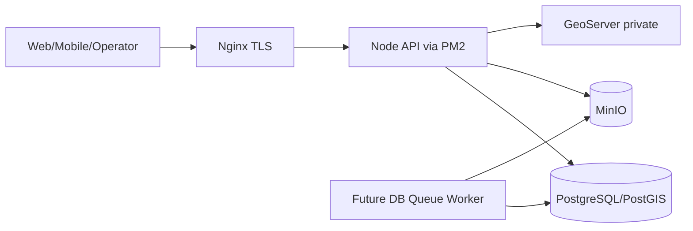

# Threat Model — Baseline Sprint 2

## Tài sản cần bảo vệ

- JWT/refresh token và mật khẩu người dùng.
- Dữ liệu đa tổ chức trong PostgreSQL/PostGIS.
- Lớp bản đồ, raster và tài liệu trên MinIO/GeoServer.
- Credential VPS, Google Earth Engine, Firebase và SMTP.
- Cơ chế job nền tương lai và nhật ký kiểm toán.

## Ranh giới tin cậy

Nginx là ingress công khai duy nhất. DB, MinIO và GeoServer là dịch vụ native VPS, chỉ bind local/private interface. Redis chưa được dùng.

## Mối đe dọa chính

| Mối đe dọa | Kiểm soát hiện tại | Tiếp theo |
|---|---|---|
| Bypass/leo thang RBAC | Permission từ DB, không bypass `system_admin`, test hồi quy | Sinh test theo toàn ma trận |
| IDOR xuyên tổ chức | `org_id` ép ở service/repository | Integration test DB thật |
| Truy cập lớp trái phép | `gis.layer_permissions`; WMS ép tên layer từ DB; WFS chỉ `GetFeature` qua ACL `export` | Đóng WMS/WFS trực tiếp tại firewall/GeoServer theo lịch vận hành |
| Brute force/token replay | Rate limit, progressive lockout, token blacklist, refresh rotation/reuse detection; local + Google OAuth identities | MFA giữ feature flag tắt đến khi có nhu cầu/UAT |
| Migration chạy đồng thời/bị sửa | Advisory lock, SHA256 checksum, transaction từng file | Backup/restore drill |
| Upload độc hại/zip bomb | Presigned PUT chỉ vào quarantine; allow-list extension; magic bytes; size limit; ClamAV INSTREAM fail-closed; SHA-256 trước promote | Bật `clamd` native và UAT malware thật; ZIP entry/decompression limits ở Sprint 3 import |
| SSRF/redirect qua GeoServer | Base URL chỉ từ server config; path nội bộ; resource identifier validation; `redirect: error`; sanitized upstream errors | Outbound firewall allow-list |
| Lộ object storage | 5 bucket private; anonymous request trả 403; empty anonymous policy; download URL ngắn hạn theo owner | TLS/đóng cổng MinIO theo lịch vận hành |
| Queue replay/trùng job | Chưa có queue nghiệp vụ | Khi có job dài: PostgreSQL `FOR UPDATE SKIP LOCKED` + idempotency; chỉ thêm Redis nếu đo được nút nghẽn |
| Lộ secret | `.env` ignored; credential MinIO/GeoServer đọc từ `.secrets/`; `.env.example` chỉ chứa path | Secret manager/rotation production |
| Xóa log che dấu hành vi | Cleanup yêu cầu DB permission, ghi audit riêng | WORM/export log production |
| Stored XSS CMS/bình luận | News plain text/Markdown; comment plain text, từ chối markup; CSP Helmet | Chỉ thêm rich HTML với maintained allowlist sanitizer |
| Lộ tài liệu nội bộ/IDOR | `visibility` lọc trong SQL; unauthorized trả 404; file metadata không lộ object key | Ma trận integration mọi role |
| Spam bình luận | Login bắt buộc, trạng thái pending, rate limit 10/15 phút | CAPTCHA/moderation analytics khi có abuse thật |
| File CMS/XXE/presigned leak | Quarantine + magic bytes + ClamAV fail-closed; XML cấm DTD/entity; URL ký 60–900 giây | Live MinIO/ClamAV UAT với fixtures thật |
| Raster lớn gây cạn tài nguyên | Upload quarantine, giới hạn 2 GiB, GeoTIFF magic bytes, ClamAV fail-closed | Đo tải/live UAT với cảnh cắt nhỏ |
| Satellite IDOR/lộ object key | Metadata API không serialize bucket/object key; file phải owner-owned/ready/clean; download RBAC | Integration anonymous + 5 role DB |
| Presigned replay/tải hàng loạt | Compare URL 60 giây; download 60–900 giây và giới hạn 20/15 phút theo user | Shared limiter store khi chạy nhiều process |
| Metadata injection/query abuse | Joi strict; SQL tham số; sort/platform allowlist; page limit ≤100 | Postman/Supertest negative cases |

## Giả định cần kiểm tra

- MinIO và GeoServer hiện vẫn có cổng reachable; người vận hành đã quyết định đóng sau. Đây là residual risk được chấp nhận tạm thời, không phải trạng thái production-ready.
- WFS/WMS trực tiếp hiện reachable; Node proxy đã read-only/ACL nhưng không thay thế firewall gate.
- `CLAMAV_ENABLED=false` đến khi `clamd` native được cài và UAT; vì fail-closed nên commit upload sẽ trả 503 khi scanner chưa bật.
- Nginx truyền đúng client IP và `TRUST_PROXY` được cấu hình chính xác.
- Mật khẩu seed bị đổi hoặc tài khoản seed bị xóa trước production.
