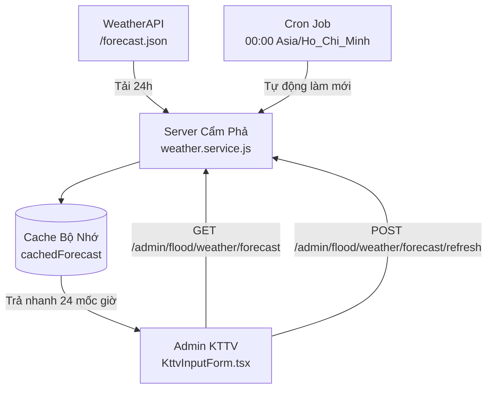

# Tài Liệu API & Dịch Vụ Dự Báo Thời Tiết 24 Giờ (WeatherAPI)

## 1. Tổng quan

Hệ thống quản lý kịch bản ngập lụt khí tượng thủy văn (KTTV) Cẩm Phả cần dữ liệu lượng mưa dự báo thực tế để mô phỏng và kích hoạt các kịch bản ngập lụt tương ứng.

Trước đây, giao diện quản trị (`admin`) gọi trực tiếp API của OpenWeatherMap từ trình duyệt client. Điều này có các hạn chế:
- Lộ API key trên trình duyệt client.
- OpenWeatherMap gói miễn phí chỉ cung cấp lượng mưa 1h/3h hiện tại, không có chi tiết từng giờ trong 24 giờ.

**Giải pháp mới:**
Server Node.js đảm nhận việc kết nối với **WeatherAPI** (`/forecast.json`), lưu cache dữ liệu dự báo 24 giờ trong bộ nhớ, tự động cập nhật qua cron job lúc **00:00 hàng ngày** (giờ Việt Nam), và cung cấp 2 API cho Admin:
1. `GET /api/v1/admin/flood/weather/forecast`: Lấy dữ liệu dự báo 24 giờ từ cache (hoặc tải lần đầu nếu chưa có).
2. `POST /api/v1/admin/flood/weather/forecast/refresh`: Chủ động gọi WeatherAPI làm mới dữ liệu tức thời khi người quản trị nhấn nút làm mới.

---

## 2. Cấu hình môi trường (`server/.env`)

Hệ thống sử dụng các biến cấu hình sau trong `server/.env`:

| Tên biến | Bắt buộc | Mặc định | Ý nghĩa |
|---|---|---|---|
| `VITE_WEATHERAPI_API_KEY` | **Có** | - | Khóa API của WeatherAPI (đã có trong `.env`) |
| `VITE_WEATHERAPI_URL_BASE` | Không | `https://api.weatherapi.com/v1` | URL gốc của WeatherAPI |
| `WEATHER_FORECAST_CRON` | Không | `0 0 * * *` | Lịch chạy cron tự động làm mới (00:00 hàng ngày) |
| `WEATHER_FORECAST_CRON_TZ` | Không | `Asia/Ho_Chi_Minh` | Múi giờ cho cron job |
| `WEATHER_FORECAST_ENABLED` | Không | `true` | Bật/tắt cron job tự động |
| `CAMPHA_CENTER_LAT` | Không | `21.002361` | Vĩ độ trung tâm thành phố Cẩm Phả |
| `CAMPHA_CENTER_LNG` | Không | `107.303749` | Kinh độ trung tâm thành phố Cẩm Phả |
| `WEATHER_LANG` | Không | `vi` | Ngôn ngữ mô tả thời tiết (`vi`) |
| `WEATHER_HTTP_TIMEOUT_MS`| Không | `10000` | Timeout gọi upstream (10 giây) |

---

## 3. Kiến trúc vận hành & Cache



- **In-memory cache**: Dữ liệu sau khi tải từ WeatherAPI được giữ trong bộ nhớ tiến trình Node.js (`cachedForecast`). Lần tải tiếp theo trả ngay lập tức mà không gọi upstream.
- **Deduplication (`inFlightPromise`)**: Khi có nhiều request gọi cùng lúc hoặc cron kích hoạt trùng thời điểm người dùng nhấn refresh, hệ thống chỉ gửi **duy nhất 1 request** đến WeatherAPI, các request khác dùng chung Promise đang chạy.
- **Fail-safe**: Nếu thao tác làm mới thất bại (mạng lỗi, upstream gián đoạn), cache hợp lệ trước đó vẫn được bảo toàn để giao diện không bị gián đoạn.

---

## 4. Danh sách API Endpoints

### 4.1. Lấy dữ liệu dự báo 24 giờ

* **Đường dẫn**: `GET /api/v1/admin/flood/weather/forecast`
* **Xác thực**: Yêu cầu Bearer JWT Token (`verifyToken`).
* **Phân quyền**: Yêu cầu quyền `flood:read`.
* **Mô tả**: Trả về dữ liệu dự báo thời tiết 24 giờ của ngày hiện tại tại Cẩm Phả. Nếu cache trống (ví dụ server mới khởi động), server tự động tải từ WeatherAPI lần đầu.

#### Cấu trúc phản hồi thành công (`200 OK`):

```json
{
  "status": "success",
  "message": "Đã tải dự báo thời tiết 24 giờ",
  "data": {
    "location": {
      "name": "Cẩm Phả",
      "region": "Quảng Ninh",
      "country": "Vietnam",
      "lat": 21.002361,
      "lon": 107.303749,
      "localtime": "2026-09-18 00:00"
    },
    "forecastDate": "2026-09-18",
    "daySummary": {
      "maxTempC": 31.5,
      "minTempC": 24.2,
      "avgTempC": 27.8,
      "totalPrecipMm": 15.6,
      "dailyChanceOfRain": 75,
      "condition": {
        "text": "Mưa rào nhẹ",
        "icon": "//cdn.weatherapi.com/weather/64x64/day/353.png",
        "code": 1240
      }
    },
    "hours": [
      {
        "time": "2026-09-18 00:00",
        "timeEpoch": 1789689600,
        "hour": "00:00",
        "tempC": 25.1,
        "feelsLikeC": 28.2,
        "humidity": 92,
        "precipMm": 0.5,
        "chanceOfRain": 45,
        "condition": {
          "text": "Mưa nhẹ",
          "icon": "//cdn.weatherapi.com/weather/64x64/night/353.png",
          "code": 1240
        },
        "windKph": 5.4,
        "windDir": "NNE",
        "uv": 0
      }
      // ... tổng cộng đúng 24 mốc giờ từ 00:00 đến 23:00
    ],
    "source": "weatherapi",
    "fetchedAt": "2026-09-18T00:00:05.123Z",
    "metadata": {
      // Dữ liệu raw gốc từ WeatherAPI chưa qua mapping của server
      "location": { "name": "Cam Pha Mines", "region": "Quảng Ninh", "country": "Vietnam", "lat": 21.017, "lon": 107.3, ... },
      "current": { "temp_c": 24.5, "condition": { ... }, "wind_kph": 6.8, ... },
      "forecast": { "forecastday": [ ... ] }
    }
  }
}
```

---

### 4.2. Làm mới dữ liệu dự báo tức thời

* **Đường dẫn**: `POST /api/v1/admin/flood/weather/forecast/refresh`
* **Xác thực**: Yêu cầu Bearer JWT Token (`verifyToken`).
* **Phân quyền**: Yêu cầu quyền `flood:run`.
* **Mô tả**: Chủ động gọi WeatherAPI để lấy dữ liệu mới nhất, cập nhật vào cache server và ghi nhận nhật ký hoạt động hệ thống (`logActivity`).

#### Cấu trúc phản hồi thành công (`200 OK`):

```json
{
  "status": "success",
  "message": "Đã làm mới dữ liệu dự báo thời tiết 24 giờ từ WeatherAPI",
  "data": {
    // Dữ liệu RainForecast24h mới nhất được cập nhật vào cache
  }
}
```

---

## 5. Cron Job tự động (`weather-forecast-daily.job.js`)

- **Tệp tin**: `server/src/jobs/weather-forecast-daily.job.js`
- **Khởi động**: Được đăng ký trong `server.js` tại khối `IS_SINGLETON_WORKER` (chỉ chạy trên 1 worker chính, tránh xung đột cluster).
- **Lịch chạy**: `0 0 * * *` (lúc 00:00 nửa đêm theo múi giờ `Asia/Ho_Chi_Minh`).
- **Nhiệm vụ**: Tự động gọi `weatherService.refreshForecast24h()`, làm mới cache cho ngày tiếp theo.
- **Graceful shutdown**: Tự động hủy tác vụ lập lịch khi server nhận tín hiệu dừng `SIGINT` / `SIGTERM`.

---

## 6. Tích hợp phía Admin (`admin`)

- **Dịch vụ**: `admin/src/service/weatherForecastService.ts`
  - `getForecast()`: Gọi `GET /api/v1/admin/flood/weather/forecast`.
  - `refreshForecast()`: Gọi `POST /api/v1/admin/flood/weather/forecast/refresh`.
- **Giao diện**: `admin/src/pages/KttvScenarios/KttvInputForm.tsx`
  - Thay thế hoàn toàn mã gọi trực tiếp OpenWeatherMap.
  - Cho phép người dùng xem dự báo 24 mốc giờ trong ngày.
  - Khi chọn một mốc giờ, lượng mưa `precipMm` của giờ đó sẽ tự động được điền vào ô `Lượng mưa hiện tại (mm/h)`.
  - Cung cấp nút **Làm mới** kèm hiệu ứng quay xoay tải (`Loader2`), tự động cập nhật TanStack Query cache và hiển thị thông báo thời gian cập nhật.
