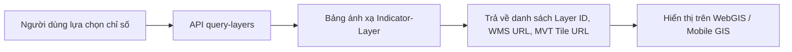

# Sprint 10 — Chỉ số Chuyên đề & Lớp Bản đồ Tương ứng

## Mục tiêu

Hệ thống cung cấp danh mục chỉ số chuyên đề (chỉ số mưa, mực nước, nguy cơ ngập, chất lượng môi trường, cảnh báo...).
Người dùng hoặc đơn vị quản lý lựa chọn bộ chỉ số -> Hệ thống tra cứu và xuất ra danh sách các lớp bản đồ GIS tương ứng (Vector Tile MVT, WMS, GeoJSON) kèm cấu hình hiển thị.

## Phạm vi API

| Method | Endpoint | Quyền | Mục đích |
|---|---|---|---|
| `GET` | `/api/v1/indicators` | Public / `citizen` | Danh sách chỉ số chuyên đề |
| `POST` | `/api/v1/indicators/query-layers` | Public / `citizen` | Tra cứu lớp bản đồ tương ứng theo bộ chỉ số chọn |
| `GET` | `/api/v1/admin/indicators` | `tnmt` | Quản lý danh mục chỉ số |
| `POST` | `/api/v1/admin/indicators` | `tnmt` | Tạo chỉ số mới |
| `PUT` | `/api/v1/admin/indicators/:id/mappings` | `tnmt` | Ánh xạ chỉ số với lớp bản đồ (Indicator -> Layers) |

## Quy trình nghiệp vụ

## Nghiệm thu

- [ ] CRUD danh mục chỉ số chuyên đề.
- [ ] Ánh xạ 1 chỉ số -> N lớp bản đồ GIS.
- [ ] Tra cứu trả đúng lớp bản đồ tương ứng kèm thang màu, legend.
- [ ] Tích hợp hiển thị WMS và MVT.
