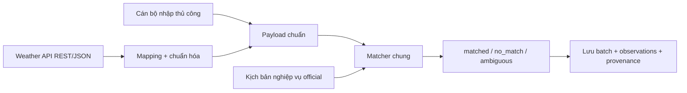
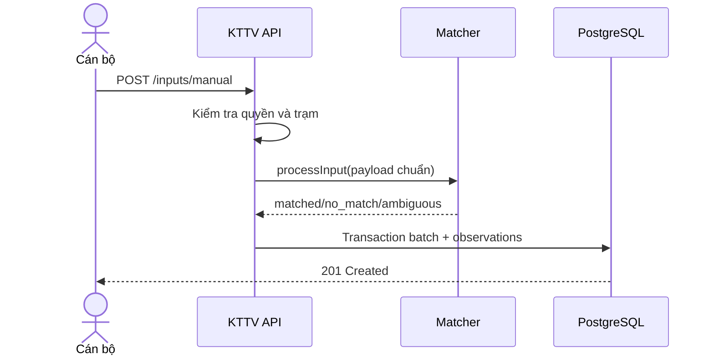
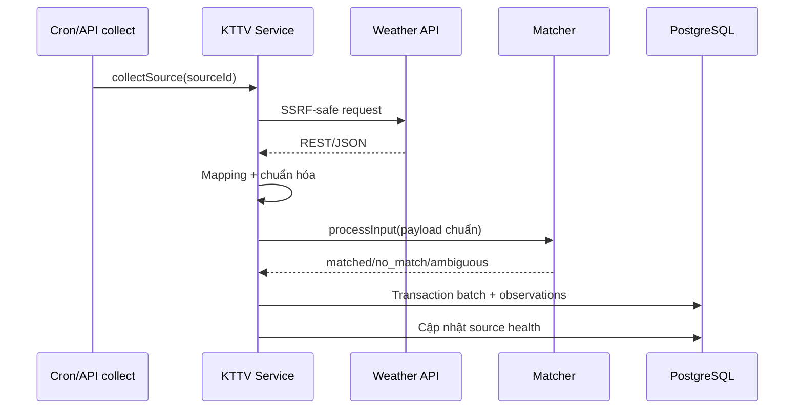

# Hướng dẫn Sprint 10 — KTTV hai chế độ và bản đồ chỉ số

> [!WARNING]
> **ĐANG CẬP NHẬT KIẾN TRÚC THEO YÊU CẦU MỚI:**
> Thiết kế cũ sử dụng matcher để ghép số liệu KTTV thành `scenario_id`.
> **Luồng mới theo yêu cầu đối tác / nhà cung cấp:** Người dùng lựa chọn các chỉ số (chỉ số mưa, chỉ số mực nước, cấp gió, nguy cơ ngập...) -> Hệ thống truy vấn và xuất ra các lớp bản đồ (Raster / WMS / Vector Tile) tương ứng.

## 1. Mục tiêu

Sprint 10 tiếp nhận số liệu khí tượng thủy văn (KTTV) theo hai chế độ:

1. **Tự động:** Weather API REST/JSON → mapping → chuẩn hóa → khớp kịch bản.
2. **Thủ công:** cán bộ nhập payload chuẩn → khớp kịch bản.

Cả hai chế độ dùng chung một matcher và cùng cách lưu kết quả.



> [!IMPORTANT]
> Weather API chỉ cung cấp số liệu. Kịch bản do đơn vị nghiệp vụ chuẩn bị.
> Sprint 10 không tự sinh kịch bản và không chạy mô hình thủy lực.

| Sprint | Trách nhiệm |
|---|---|
| Sprint 10 | Nhận số liệu và chọn kịch bản phù hợp |
| Sprint 11 | Gắn bộ tham số cho kịch bản |
| Sprint 12 | Chạy mô hình |

---

## 2. Thành phần nghiệp vụ

### 2.1. Trạm quan trắc

Trạm cho biết số liệu thuộc vị trí nào. Mỗi trạm có mã duy nhất, tên, loại trạm,
kinh độ, vĩ độ, cao độ, đơn vị quản lý và các ngưỡng nếu có.

Loại trạm hỗ trợ:

```text
mua
thuy_van
hai_van
khi_tuong_be_mat
```

### 2.2. Nguồn KTTV

Nguồn mô tả cách lấy số liệu tự động:

- URL Weather API.
- Kiểu dịch vụ và định dạng response.
- Phương thức xác thực.
- Mapping JSON.
- Cron thu thập.
- Retry và thời gian chờ.
- Trạng thái bật/tắt.

Sprint 10 hiện chỉ nghiệm thu adapter:

```text
REST + JSON
```

WMS, WFS, WCS, WMTS, GEE và FTP chưa phải adapter thu thập Sprint 10.

### 2.3. Kịch bản

Kịch bản là quy tắc nghiệp vụ dùng để phân loại số liệu. Kịch bản có:

- `code` và `version`.
- `matchRule`.
- `matchPriority`; số nhỏ hơn thắng.
- `draft`, `official`, `archived`.
- Trạng thái bật/tắt.
- Khoảng thời gian hiệu lực.

Matcher chỉ xét kịch bản `official`, đang bật và còn hiệu lực tại thời điểm quan trắc.

### 2.4. Input batch và observation

Một lần nhập hoặc thu thập tạo một `input_batch`. Mỗi biến tạo một `observation`.

```json
{
  "stationCode": "CP-WEATHER",
  "observedAt": "2026-08-09T09:00:00Z",
  "values": {
    "rain_1h_mm": { "value": 35.2, "unit": "mm" },
    "temperature_c": { "value": 28.1, "unit": "celsius" }
  }
}
```

Batch trên tạo hai observations.

---

## 3. Matcher

### 3.1. Rule

Rule dùng đúng một nhóm `all` hoặc `any`:

- `all`: mọi điều kiện phải đúng.
- `any`: một điều kiện đúng là đủ.
- Tối đa 20 điều kiện.
- Không lồng nhóm.

Ví dụ mưa từ 30 đến 50 mm:

```json
{
  "all": [
    {
      "variable": "rain_1h_mm",
      "unit": "mm",
      "op": "between",
      "value": [30, 50]
    }
  ]
}
```

Toán tử: `eq`, `gt`, `gte`, `lt`, `lte`, `between`.

Tên biến và đơn vị phải khớp chính xác. Rule yêu cầu `mm`, input gửi `cm` sẽ không khớp.

### 3.2. Cách chọn

1. Lấy kịch bản official, đang bật, còn hiệu lực.
2. Đánh giá rule.
3. Giữ các kịch bản khớp.
4. Chọn priority nhỏ nhất.
5. Trả một trong ba kết quả.

| Kết quả | Ý nghĩa | `scenario_id` | Candidate IDs |
|---|---|---:|---|
| `matched` | Một kịch bản thắng | Có | Một ID |
| `no_match` | Không có rule phù hợp | `null` | Rỗng |
| `ambiguous` | Nhiều kịch bản cùng priority tốt nhất | `null` | Nhiều ID |

`no_match` và `ambiguous` vẫn được lưu. Hệ thống không tự chọn bừa.

---

## 4. Phân quyền

Toàn bộ endpoint nằm dưới:

```text
/api/v1/admin/kttv
```

| Thao tác | Permission |
|---|---|
| Đọc nguồn, trạm và input | `kttv.read` |
| Tạo/cập nhật nguồn | `kttv.create_source` |
| Test kết nối | `kttv.test_source` |
| Quản lý trạm | `kttv.manage_stations` |
| Nhập thủ công | `kttv.manual_input` |
| Tạo/sửa draft | `kttv.match_scenario` |
| Collect/lập lịch | `kttv.schedule` |
| Đọc kịch bản | `hydro.read` |
| Ban hành kịch bản | `hydro.publish_scenario` |

Chỉ Sở TNMT có quyền ban hành kịch bản official trong ma trận hiện tại.

---

## 5. Cấu hình môi trường

```dotenv
# 32 byte dưới dạng 64 ký tự hex; key riêng cho từng môi trường.
KTTV_CREDENTIAL_ENCRYPTION_KEY=<64-hex-characters>

# Host Weather API được phép gọi.
KTTV_ALLOWED_SOURCE_HOSTS=api.open-meteo.com

# Chỉ bật trên một replica/worker.
KTTV_COLLECTION_ENABLED=false

# Lịch đồng bộ cron nguồn.
KTTV_SCHEDULE_SYNC_CRON=*/5 * * * *
```

Tạo key local:

```powershell
node -e "console.log(require('crypto').randomBytes(32).toString('hex'))"
```

Không commit key. Với nhiều replica, chỉ một replica đặt
`KTTV_COLLECTION_ENABLED=true`.

---

## 6. API

### Nguồn

| Method | Endpoint |
|---|---|
| `GET` | `/admin/kttv/sources` |
| `POST` | `/admin/kttv/sources` |
| `GET` | `/admin/kttv/sources/:id` |
| `PATCH` | `/admin/kttv/sources/:id` |
| `DELETE` | `/admin/kttv/sources/:id?expectedUpdatedAt=...` |
| `POST` | `/admin/kttv/sources/:id/test-connection` |
| `POST` | `/admin/kttv/sources/:id/collect` |

### Trạm

| Method | Endpoint |
|---|---|
| `GET` | `/admin/kttv/stations` |
| `POST` | `/admin/kttv/stations` |
| `GET` | `/admin/kttv/stations/:code` |
| `PATCH` | `/admin/kttv/stations/:code` |
| `DELETE` | `/admin/kttv/stations/:code?expectedUpdatedAt=...` |

### Kịch bản

| Method | Endpoint |
|---|---|
| `GET` | `/admin/kttv/scenarios` |
| `POST` | `/admin/kttv/scenarios` |
| `GET` | `/admin/kttv/scenarios/:id` |
| `PATCH` | `/admin/kttv/scenarios/:id` |
| `POST` | `/admin/kttv/scenarios/:id/publish` |

Không có API xóa kịch bản. Kịch bản official được giữ để bảo toàn lịch sử.

### Input

| Method | Endpoint |
|---|---|
| `POST` | `/admin/kttv/inputs/manual` |
| `GET` | `/admin/kttv/inputs` |
| `GET` | `/admin/kttv/inputs/:id` |

---

## 7. Walkthrough PowerShell

> [!WARNING]
> Ví dụ tạo dữ liệu thật. Chạy trên DB local/acceptance. Không chạy mù trên production.

### 7.1. Đăng nhập và helper

```powershell
$Api = 'http://127.0.0.1:3018/api/v1'
$Password = Read-Host 'Mật khẩu' -AsSecureString
$Credential = [PSCredential]::new('tnmt@campha.gov.vn', $Password)

$Login = Invoke-RestMethod `
  -Method Post `
  -Uri "$Api/auth/login" `
  -ContentType 'application/json' `
  -Body (@{
    email = $Credential.UserName
    password = $Credential.GetNetworkCredential().Password
  } | ConvertTo-Json)

$Headers = @{ Authorization = "Bearer $($Login.data.accessToken)" }

function Invoke-CamPhaApi {
  param(
    [Parameter(Mandatory)] [string] $Method,
    [Parameter(Mandatory)] [string] $Path,
    $Body = $null
  )

  $Params = @{
    Method = $Method
    Uri = "$Api$Path"
    Headers = $Headers
  }

  if ($null -ne $Body) {
    $Params.ContentType = 'application/json'
    $Params.Body = $Body | ConvertTo-Json -Depth 20
  }

  Invoke-RestMethod @Params
}
```

Password và token chỉ nằm trong RAM của phiên PowerShell.

### 7.2. Tạo trạm

```powershell
$Station = Invoke-CamPhaApi Post '/admin/kttv/stations' @{
  code = 'GUIDE_CP_WEATHER'
  name = 'Trạm hướng dẫn Cẩm Phả'
  stationType = 'mua'
  longitude = 107.31
  latitude = 21.01
  managingOrg = 'Sở TNMT Quảng Ninh'
  isUsedForBasin = $true
}
```

### 7.3. Tạo hai draft kịch bản

```powershell
$Normal = Invoke-CamPhaApi Post '/admin/kttv/scenarios' @{
  code = 'GUIDE_RAIN_NORMAL'
  name = 'Mưa dưới 30 mm'
  description = 'Kịch bản hướng dẫn — không dùng production'
  matchPriority = 100
  matchRule = @{
    all = @(@{
      variable = 'rain_1h_mm'
      unit = 'mm'
      op = 'lt'
      value = 30
    })
  }
}

$Heavy = Invoke-CamPhaApi Post '/admin/kttv/scenarios' @{
  code = 'GUIDE_RAIN_HEAVY'
  name = 'Mưa từ 30 mm'
  description = 'Kịch bản hướng dẫn — không dùng production'
  matchPriority = 10
  matchRule = @{
    all = @(@{
      variable = 'rain_1h_mm'
      unit = 'mm'
      op = 'gte'
      value = 30
    })
  }
}
```

Hai rule không chồng:

```text
rain < 30   → GUIDE_RAIN_NORMAL
rain >= 30  → GUIDE_RAIN_HEAVY
```

### 7.4. Ban hành

Draft chưa được matcher dùng. Ban hành bằng:

```powershell
$NormalPublished = Invoke-CamPhaApi Post "/admin/kttv/scenarios/$($Normal.data.id)/publish" @{
  expectedUpdatedAt = $Normal.data.updated_at
  isEnabled = $true
}

$HeavyPublished = Invoke-CamPhaApi Post "/admin/kttv/scenarios/$($Heavy.data.id)/publish" @{
  expectedUpdatedAt = $Heavy.data.updated_at
  isEnabled = $true
}
```

Official bất biến. Muốn thay đổi, tạo version draft mới cùng `code`, rồi publish.

### 7.5. Nhập thủ công

```powershell
$Manual = Invoke-CamPhaApi Post '/admin/kttv/inputs/manual' @{
  stationCode = 'GUIDE_CP_WEATHER'
  observedAt = (Get-Date).ToUniversalTime().ToString('o')
  values = @{
    rain_1h_mm = @{
      value = 35.2
      unit = 'mm'
    }
  }
}

$Manual.data
```

Kỳ vọng:

```text
input_mode = manual
match_status = matched
scenario_code = GUIDE_RAIN_HEAVY
source_id = null
entered_by = ID cán bộ
```

### 7.6. Tạo nguồn Open-Meteo

```powershell
$Source = Invoke-CamPhaApi Post '/admin/kttv/sources' @{
  name = 'Open-Meteo hướng dẫn Cẩm Phả'
  provider = 'Open-Meteo'
  serviceType = 'REST'
  endpointUrl = 'https://api.open-meteo.com/v1/forecast?latitude=21.01&longitude=107.31&current=precipitation&timezone=UTC'
  responseFormat = 'JSON'
  variables = @{
    observedAtPath = 'current.time'
    observedAtFormat = 'iso'
    stationCode = 'GUIDE_CP_WEATHER'
    mappings = @(@{
      path = 'current.precipitation'
      variable = 'rain_1h_mm'
      unit = 'mm'
      factor = 1
      offset = 0
      min = 0
      max = 500
    })
  }
  retryCount = 3
  retryDelaySec = 60
  cronExpr = '*/15 * * * *'
  isEnabled = $true
}
```

Host phải nằm trong `KTTV_ALLOWED_SOURCE_HOSTS`.

### 7.7. Test và collect

```powershell
$Connection = Invoke-CamPhaApi Post "/admin/kttv/sources/$($Source.data.id)/test-connection"
$Connection.data

$Automatic = Invoke-CamPhaApi Post "/admin/kttv/sources/$($Source.data.id)/collect"
$Automatic.data
```

Test-connection chỉ xem endpoint gọi được. Collect mới chuẩn hóa, match và lưu input.

Kỳ vọng automatic:

```text
input_mode = automatic
source_id = ID nguồn
entered_by = null
raw_payload = JSON gốc Weather API
```

### 7.8. Tra cứu

```powershell
$Inputs = Invoke-CamPhaApi Get '/admin/kttv/inputs?stationCode=GUIDE_CP_WEATHER&page=1&limit=20'

Invoke-CamPhaApi Get '/admin/kttv/inputs?inputMode=automatic&matchStatus=matched&page=1&limit=20'

$Detail = Invoke-CamPhaApi Get "/admin/kttv/inputs/$($Automatic.data.id)"
$Detail.data
```

Chi tiết gồm snapshot, raw payload, provenance, match status, scenario code/version và
observations.

---

## 8. Hai luồng xử lý

### Manual



```text
input_mode = manual
source_id = null
entered_by = user ID
```

### Automatic



```text
input_mode = automatic
source_id = source ID
entered_by = null
```

Cả hai hội tụ tại:

```text
listMatchableScenarios(observedAt)
  → matchScenarios(scenarios, values, observedAt)
  → createInput(input + match)
```

---

## 9. Mapping Weather API

```json
{
  "observedAtPath": "current.time",
  "observedAtFormat": "iso",
  "stationCode": "CP-WEATHER",
  "mappings": [
    {
      "path": "current.precipitation",
      "variable": "rain_1h_mm",
      "unit": "mm",
      "factor": 1,
      "offset": 0,
      "min": 0,
      "max": 500
    }
  ]
}
```

Công thức:

```text
value = raw × factor + offset
```

Định dạng thời gian:

| Giá trị | Cách đọc |
|---|---|
| `iso` | ISO-8601 |
| `unix_seconds` | Unix theo giây |
| `unix_milliseconds` | Unix theo mili-giây |

Collect trả `422` nếu path thiếu, giá trị không phải số, ngoài `min/max`, thời gian sai
hoặc trạm mapping không tồn tại.

---

## 10. Scheduler

Bật bằng:

```dotenv
KTTV_COLLECTION_ENABLED=true
KTTV_SCHEDULE_SYNC_CRON=*/5 * * * *
```

Scheduler:

1. Đọc source đang bật và có cron.
2. Tạo task động.
3. Đồng bộ khi cron/source thay đổi.
4. Chặn hai lượt cùng source chạy chồng.
5. Retry theo cấu hình.
6. Chờ lượt đang chạy khi shutdown.

```text
Số lần tối đa = retryCount + 1
Khoảng chờ = retryDelaySec
```

---

## 11. Idempotency và optimistic locking

Automatic có unique key:

```text
(source_id, station_code, observed_at)
```

Cùng bản tin automatic không tạo batch/observation trùng. Manual không áp dụng unique
key này.

PATCH, DELETE và publish dùng `expectedUpdatedAt` từ GET gần nhất. Nếu resource đã đổi:

```text
409 OPTIMISTIC_LOCK_CONFLICT
```

Client phải tải lại trước khi gửi lại.

---

## 12. Bảo mật

Credential nguồn hỗ trợ:

- `api_key` + `credential.apiKey`.
- `bearer` + `credential.token`.
- `basic` + `credential.username/password`.

Credential được mã hóa AES-256-GCM. API chỉ trả `hasCredential` và bốn ký tự cuối.

Test-connection và collect qua safe fetch:

- Host allowlist.
- Chặn loopback/private metadata IP.
- DNS pinning.
- Không redirect tùy ý.
- Timeout.
- Giới hạn response.

Không ghi credential vào log, manifest, screenshot hoặc source code.

---

## 13. Dữ liệu và audit

| Bảng | Nội dung |
|---|---|
| `kttv.sources` | Nguồn, mapping, lịch và health |
| `kttv.stations` | Trạm |
| `hydro.scenarios` | Version kịch bản và rule |
| `kttv.input_batches` | Lần nhập/thu thập và match |
| `kttv.observations` | Từng biến đo |

Batch và observations được ghi trong cùng transaction. Một observation lỗi làm toàn bộ
batch rollback.

Observation mới có `quality_flag=valid`. Schema còn hỗ trợ `suspect`, `invalid`, `missing`.

Source health lưu:

- `last_attempt_at`.
- `last_success_at`.
- `last_error_code`.
- `last_http_status`.
- `last_response_bytes`.

---

## 14. Lỗi thường gặp

| HTTP/lỗi | Nguyên nhân | Cách xử lý |
|---|---|---|
| `401` | Token thiếu/hết hạn | Login/refresh |
| `403` | Thiếu permission | Kiểm tra RBAC |
| `404` trạm | Mapping sai/trạm chưa có | Tạo trạm hoặc sửa mapping |
| `409 OPTIMISTIC_LOCK_CONFLICT` | Resource đã đổi | GET lại rồi gửi timestamp mới |
| `409 SCENARIO_NOT_DRAFT` | Sửa official | Tạo version draft mới |
| `422 SOURCE_NOT_COLLECTABLE` | REST/JSON config thiếu hoặc source tắt | Sửa config |
| `422 INVALID_OBSERVED_AT` | Path/format thời gian sai | Sửa mapping |
| `422 SOURCE_VALUE_INVALID` | Giá trị thiếu/sai/out-of-range | Sửa mapping/upstream |
| SSRF blocked | Host không allowlist/IP bị cấm | Kiểm tra host; không tắt bảo vệ |
| `no_match` | Không rule phù hợp | Nghiệp vụ bổ sung version |
| `ambiguous` | Rule chồng, cùng priority | Sửa rule/priority |

> [!CAUTION]
> Không ép `ambiguous` thành `matched` trong code. Đây là lỗi cấu hình nghiệp vụ.

---

## 15. Checklist vận hành

### Trước automatic

- [ ] Trạm mapping tồn tại.
- [ ] Source REST/JSON.
- [ ] Host trong allowlist.
- [ ] Mapping đủ thời gian, trạm và biến.
- [ ] Factor/offset/min/max đúng.
- [ ] Test-connection trả `2xx` và JSON đúng.
- [ ] Kịch bản official, bật, còn hiệu lực.
- [ ] Rule và priority được duyệt.
- [ ] Chỉ một worker bật scheduler.

### Sau collect

- [ ] Mode đúng.
- [ ] `source_id`/`entered_by` đúng.
- [ ] Snapshot đúng đơn vị.
- [ ] Raw payload đầy đủ.
- [ ] Match status hợp lý.
- [ ] Observations cùng batch.
- [ ] Source health cập nhật.
- [ ] Collect lại không tạo automatic trùng.

---

## 16. Kiểm thử

Unit:

```powershell
npm test -- --runInBand `
  src/services/__tests__/kttv.service.test.js `
  src/utils/__tests__/kttv-matcher.util.test.js `
  src/jobs/__tests__/kttv-collection.job.test.js
```

Integration chỉ trên DB test:

```powershell
$env:DB_NAME='campha_test'
npm run test:integration -- `
  src/database/__tests__/integration/sprint10a-kttv.integration.test.js `
  src/database/__tests__/integration/sprint10b-kttv-matching.integration.test.js
```

Acceptance:

```powershell
$env:API_BASE_URL='http://127.0.0.1:3018'
$env:API_TEST_PASSWORD='<secret>'
npm run acceptance:verify
```

Không đổi guard để chạy integration write suite trên DB nghiệp vụ/production.

---

## 17. Tích hợp web/mobile

Sprint 10 hiện là module admin. Citizen không gọi trực tiếp.

Màn hình quản trị nên:

1. Có danh sách nguồn, trạm, kịch bản và input.
2. Dùng rule builder `all/any`; không nhận JavaScript tự do.
3. Hiện badge `draft`, `official`, `archived`.
4. Hiện rõ `matched`, `no_match`, `ambiguous`.
5. Với ambiguous, hiện candidate IDs.
6. Gửi `expectedUpdatedAt` khi cập nhật/ban hành/xóa.
7. Khi `409`, tải lại trước khi lưu.
8. Không lưu credential trong local storage/log client.
9. Kiểm tra `data.match_status`, không chỉ HTTP `200/201`.

---

## 18. Ngoài phạm vi Sprint 10

- Tự sinh kịch bản.
- Chạy engine thủy lực.
- Gắn bộ tham số mô hình.
- Thiessen/IDW.
- Cắt lớp không gian.
- Sinh raster dự báo.
- Fallback đa nguồn.
- Phát cảnh báo tự động.
- Hiệu chỉnh mô hình.

GeoServer không nằm trong luồng cốt lõi Sprint 10.

---

## 19. Mã nguồn liên quan

- [SPRINT_10_BACKLOG.md](file:///C:/Users/SunSun/Documents/DuAN_20226/campha/server-campha/docs/sprints/SPRINT_10_BACKLOG.md)
- [kttv.routes.js](file:///C:/Users/SunSun/Documents/DuAN_20226/campha/server-campha/src/routes/kttv.routes.js)
- [kttv.validator.js](file:///C:/Users/SunSun/Documents/DuAN_20226/campha/server-campha/src/validators/kttv.validator.js)
- [kttv.controller.js](file:///C:/Users/SunSun/Documents/DuAN_20226/campha/server-campha/src/controllers/kttv.controller.js)
- [kttv.service.js](file:///C:/Users/SunSun/Documents/DuAN_20226/campha/server-campha/src/services/kttv.service.js)
- [kttv-matcher.util.js](file:///C:/Users/SunSun/Documents/DuAN_20226/campha/server-campha/src/utils/kttv-matcher.util.js)
- [kttv.repository.js](file:///C:/Users/SunSun/Documents/DuAN_20226/campha/server-campha/src/repositories/kttv.repository.js)
- [kttv-collection.job.js](file:///C:/Users/SunSun/Documents/DuAN_20226/campha/server-campha/src/jobs/kttv-collection.job.js)
- [060_hydro_scenario_matching.sql](file:///C:/Users/SunSun/Documents/DuAN_20226/campha/server-campha/src/database/migrations/060_hydro_scenario_matching.sql)
